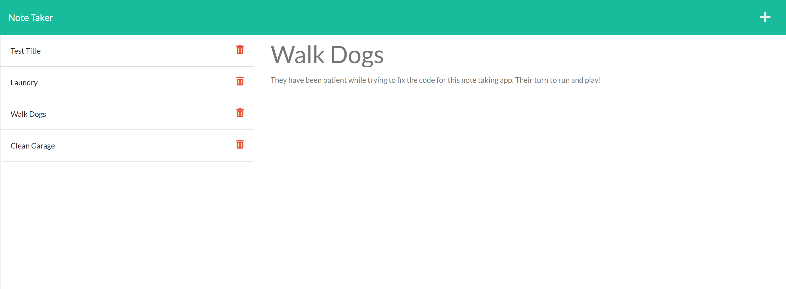

# 11-Express.js-Note_Taker
  
  
  
  ## Description
  Simple server application that allows a user to generate a list of Notes. Once generated, they have an option to delete the notes. Notes are stored in a file on the server for access from any device, etc. The server runs using express and is currently deployed using Heroku.

  

  ## Table of Contents
  * [Installation](#installation)
  * [Usage](#usage)
  * [Contributing](#contributing)
  * [Tests](#tests)
  * [License](#license)
  * [Questions](#questions)
  
  ## Installation
  Visit the Heroku application (no installation required to use)

  ## Usage
  Visit the following link:  
  [Note Taker Application](https://peaceful-eyrie-11468.herokuapp.com/)
  The application loads a homepage with an option to get started, which takes you to the notes page, where you can view existing notes, add and delete. 

  ## Contributing
  No contributions at this time.

  ## Tests
  No tests included at this time.

  ## License
  MIT License
  

  ## Questions
  If you have questions, you can reach me via Github:
  [irv0735](https://github.com/irv0735)

  Or contact via email:
  irv0735@gmail.com

